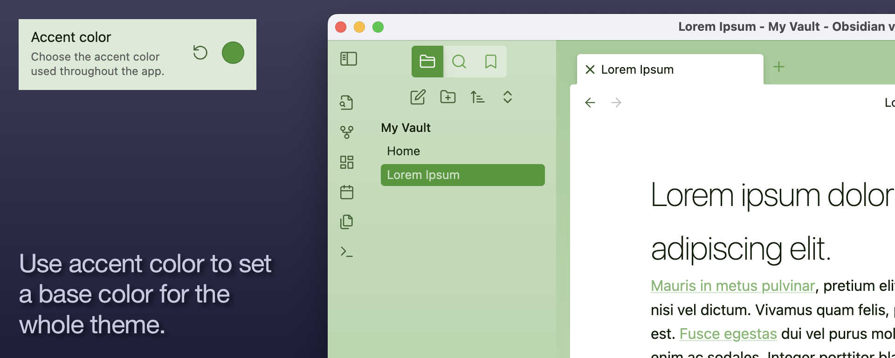
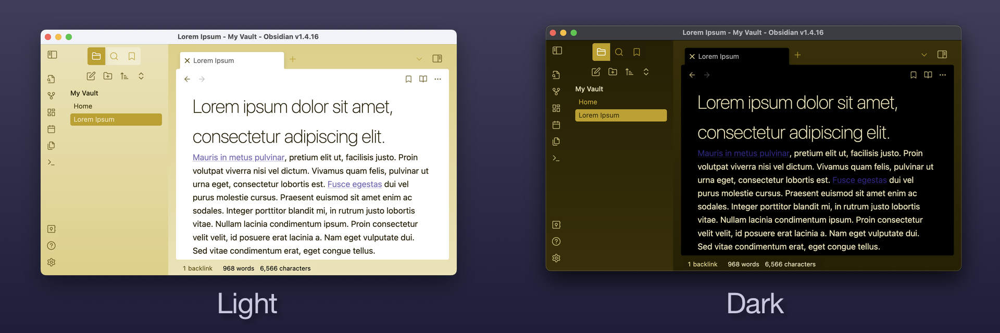
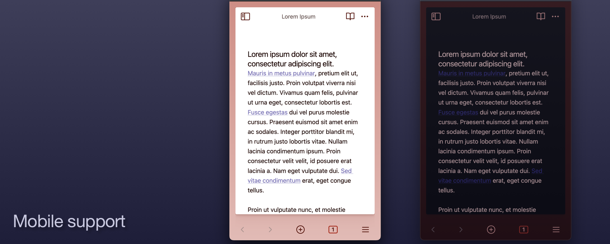
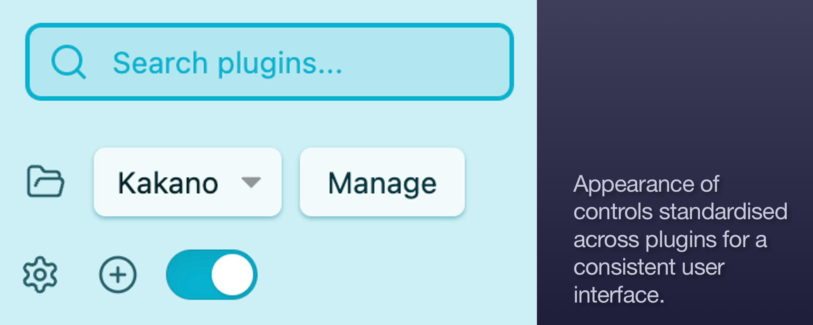
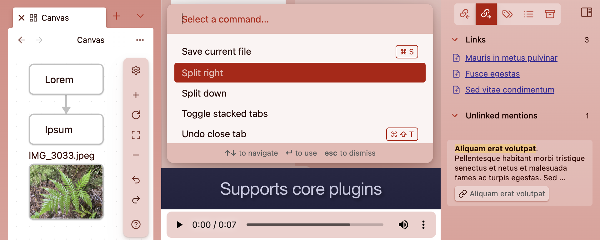

# Kakano

Kakano is an [Obsidian](https://obsidian.md/) theme with a smooth gradient background derived from a user-selected base color.

- [Kakano](#kakano)
  - [Getting started](#getting-started)
  - [Features](#features)
    - [Choose a base color](#choose-a-base-color)
    - [Light mode, dark mode, and mobile](#light-mode-dark-mode-and-mobile)
    - [Standardised controls](#standardised-controls)
    - [Properties below content](#properties-below-content)
    - [Follows OS standards by default](#follows-os-standards-by-default)
    - [Alternate checkboxes](#alternate-checkboxes)
    - [Supports core plugins](#supports-core-plugins)
    - [Settings](#settings)
  - [Plugin support](#plugin-support)
    - [Core Plugins supported](#core-plugins-supported)
  - [Roadmap](#roadmap)
  - [About](#about)

## Getting started

1. Install the Kakano theme
   [Open directly in Obsidian](obsidian://show-theme?name=Kakano) or open Obsidian settings and navigate to `Appearance`, then `Manage` and type "Kakano" into the `FIlter...` field. Click on `Install and use`.
2. (Optional) Install the [Style Settings plugin](https://github.com/mgmeyers/obsidian-style-settings)
   This will give you access to some additional theme settings.
3. Set your vault's base color
   - If you're not using Style Settings, navigate to `Appearance` in the Obsidian settings, and use the `Accent color` control.
   - If you're using Style Settings, navigate to `Style Settings` in the Obsidian settings and open the `Kakano` section. Use the `Base color` control.

## Features
### Choose a base color

Kakano starts with a user-selected base color, and generates lighter and darker versions for a cohesive overall user interface with smooth gradient backgrounds. If you reguarly use multiple vaults, set a different accent color for each to make them easy to tell apart at a glance. With Obsidian controls placed on a colored background, there's a clear visual distinction between your content and the tool you use to manage it.

> [!info]
> I use a work vault with a company brand color, and a separate green vault for my own personal notes.

- With core plugins, the base color will be your accent color.
- If the [Style Settings](https://github.com/mgmeyers/obsidian-style-settings) plugin is installed, it provides a separate Kakano base color setting, so you can have one color for your overall theme, and keep the accent color for links and tags.

### Light mode, dark mode, and mobile

Supports light mode and dark mode with the same base color, on desktop and mobile.

### Standardised controls

The appearance of buttons, switches, form fields and other controls is standardised across different modules, so the user interface looks and behaves consistently.

### Properties below content

Some people pay a lot of attention to propertioes on their notes, others use them occasionally. If you want them around but not in the way, Kakano let syou place them below your main note content. Currently this only works for Live Preview mode.

### Follows OS standards by default

- On macOS, close buttons appear at the left of tabs and modals, as standard.
- Kakano uses system fonts by default to be consistent with other apps. It respects user font choices if you prefer something else.

### Alternate checkboxes

Supports some common alternate checkboxes:
`- [/]` for "partially done"
`- [<]` for "scheduling"
`- [-]` for "cancelled"
`- [>]` for "forwarded"

### Supports core plugins

Kakano styles all the core Obsidian plugins.[^1]

[^1]: OK, almost all of them. I have a couple left to finish.

### Settings
If the [Style Settings](https://github.com/mgmeyers/obsidian-style-settings) plugin is installed, Kakano offers the following settings.
- **Base color**
  Sets a base color that will be used by Kakano independently of the accent color. This allows you to use one color for Kakano, and a separate color for accents in your notes.
- **Properties position**
  In Live Preview mode, properties can be positioned before (default) or after the main note content. If you rarely use properties, you may prefer to make them less prominent.
  _This setting only works for Live Preview mode. Reading mode doesn't provide suitable HTML structure to support it, and Source Mode makes properties editable within the main content area.

## Plugin support
Kakano has specific styling for the following plugins:

### Core Plugins supported
- Audio recorder
- Backlinks
- Bookmarks
- Canvas
- Command Palette
- Files
- File Recovery
- Format converter
- Graph view
- Note composer
- Outgoing Links
- Outline
- Page Preview
- Properties view
- Quick switcher
- Random note
- Search
- Slash commands
- Slides
- Sync
- Tags view
- Templates
- Unique note creator
- Word count
- Workspaces

## Roadmap

Kakano is a one-person hobby. I'm having a great time exploring what Obsidian can do, and how far CSS has come in recent years. I want to sweat the details and apply good usability practices, but it's also something I'm doing for fun. Sometimes I'll change things on a whim, or focus on obscure areas of the UI because they present interesting challenges.

There are, however, some key areas I want to improve:

1. Support for all the core plugins. I still need to work on Publish, as I don't use it personally.
1. Dark mode. At the moment it's mostly just an inverse of light mode, but I'd like to give it specific attention.
1. Mobile.
1. Support for the most popular community themes.

## About
I'm Isaac Freeman, a software developer in Aotearoa/New Zealand. I love to explore usability and design.

> [!tip]
> I'm currently looking for work, so let me know if you're looking for a developer in Ruby on Rails or similar web technologies.

- [Personal site](https://isaac.freeman.org.nz)
- [Github profile](https://github.com/isaacfreeman)
- [Mastodon](https://cloudisland.nz/@isaacfreeman)
- [Email](mailto:isaac@freeman.org.nz)

_Kakano_ means "colour" in the Te Reo Māori – the Māori language of New Zealand. Some words for specific colours are:

- _Whero_ – Red
- _Karaka_ – Orange
- _Kōwhai_ – Yellow
- _Kākāriki_ – Green
- _Kahurangi_ – Blue
- _Waiporoporo_ – Purple
- _Mangu_ – Black
- _Mā_ – White
- _Kiwikiwi_ – Grey
